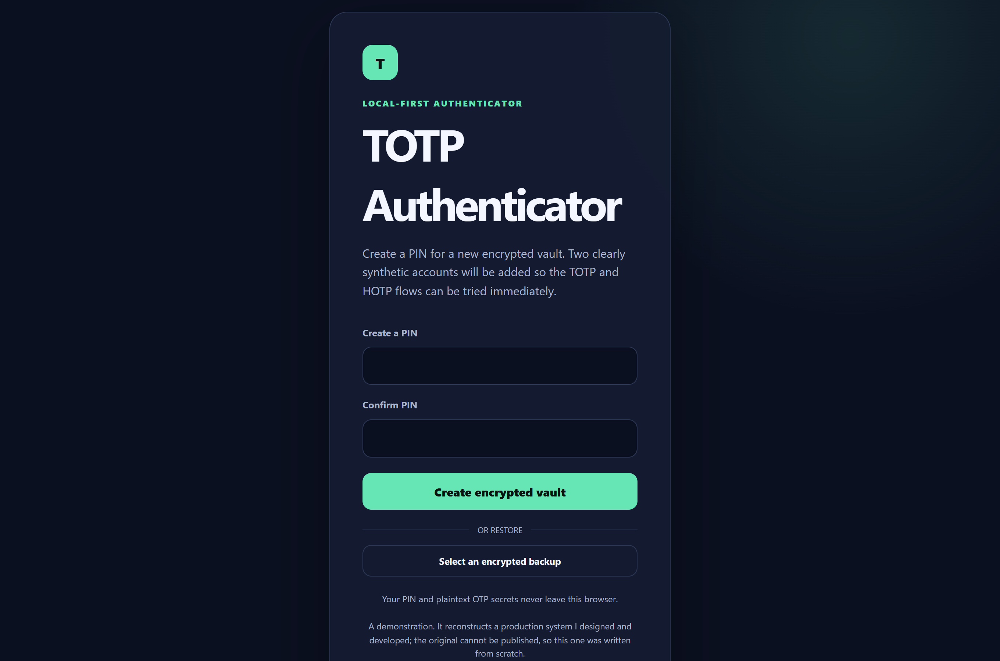

# TOTP Authenticator

TOTP Authenticator is a small Angular application that demonstrates standards-compliant TOTP and HOTP generation without sending secrets outside the browser. Its local vault is encrypted before it is written to IndexedDB, and encrypted JSON backups can be moved between browser profiles.

The original was built for a client and lives in a private repository. This is an independent reimplementation, written from scratch with synthetic data.



## What it demonstrates

- RFC 4226 HOTP and RFC 6238 TOTP implemented with the Web Crypto API.
- HMAC SHA-1, SHA-256 and SHA-512 with six, seven or eight-digit codes.
- Live TOTP countdowns and explicit HOTP counter advancement.
- `otpauth://` parsing from pasted text, a QR image or the device camera.
- A PIN-derived AES-256-GCM vault stored in IndexedDB.
- Encrypted JSON backup and restore.
- Automated checks against the official RFC test vectors.

The first vault contains two conspicuously synthetic accounts under the reserved `.test` domain. Their shared test secret comes from the public RFC vectors and must never be used for a real account.

## Architecture

```text
QR / image / manual entry
            │
            ▼
     otpauth parser ─────► Web Crypto HOTP/TOTP ─────► live code
            │
            ▼
       vault model
            │
    PBKDF2-SHA-256 (PIN)
            │
       AES-256-GCM
            │
            ├────────────► IndexedDB
            └────────────► encrypted JSON backup
```

The cryptographic and storage layers are independent of the Angular components. `src/app/core/otp` contains the RFC logic, `src/app/core/crypto` owns key derivation and authenticated encryption, and `src/app/core/storage` is the only IndexedDB boundary. The UI never persists the PIN; it remains in memory only while the vault is unlocked.

## Requirements

- Node.js 20.11 or newer.
- npm 10 or newer.
- A current Chromium, Firefox or Safari browser with Web Crypto and IndexedDB support.
- A camera is optional. Camera capture works on `localhost`; QR image import and manual entry work without it.
- Chrome or Chromium specifically, to run the tests: `npm test` drives ChromeHeadless. The application itself runs in any of the three.

Nothing else. No database, no container, no server of any kind and no account anywhere: the vault is encrypted in the browser and never leaves it.

**Measured, not estimated:** `npm install` writes **284 MB** into
`node_modules` — an Angular toolchain is large — and that is the whole of the
network cost. The application ships nothing at runtime: no font, no analytics,
no request anywhere. Node **20.11** is the exact version continuous integration
runs on, so the floor above is a fact rather than a claim.

**To put the machine back:** delete `node_modules/` and the clone. Nothing is
installed globally and nothing is registered. The vault lives in the browser's
IndexedDB under `http://localhost:4200`, so clearing site data for that origin
removes it — and the application unregisters any service worker left on that
port by something else, since it is an origin shared with every project anybody
has ever developed there.

## Run locally

Run these commands in order:

```bash
git clone https://github.com/riccardosapuppo/totp-authenticator.git
cd totp-authenticator
npm install
npm start
```

`npm start` is the single startup command. It runs one Angular development-server process and opens no external service. Visit [http://localhost:4200](http://localhost:4200).

On first use, choose a numeric PIN containing 6–12 digits. The app creates an encrypted local vault and loads the two synthetic accounts. Click a displayed code to copy it.

## Test and build

After installing the dependencies:

```bash
npm test
npm run build
```

`npm test` uses Chrome Headless. The suite checks all ten RFC 4226 counters, the RFC 6238 timestamps for SHA-1, SHA-256 and SHA-512, URI validation, authenticated encryption, wrong-PIN rejection and IndexedDB persistence.

## Import accounts

TOTP Authenticator accepts both TOTP and HOTP Key URI Format values:

```text
otpauth://totp/Northstar%20Demo:demo%40example.test?secret=GEZDGNBVGY3TQOJQGEZDGNBVGY3TQOJQ&issuer=Northstar%20Demo
```

You can paste a URI, select an image containing its QR code, use the camera, or enter the fields manually. Imported secrets are encrypted when the account is saved.

For HOTP, the counter is advanced only through the **Next code** action. This makes the state change visible and avoids silently desynchronising a token.

## Backup and restore

**Download backup** exports the same encrypted envelope used by IndexedDB. It contains the PBKDF2 salt, iteration count, AES-GCM IV and ciphertext; it does not contain the PIN or account data in plaintext.

To restore, enter the PIN that encrypted the backup and select its JSON file from either the locked screen or the open vault. Successful restoration replaces the vault currently stored in the browser. AES-GCM authentication makes a wrong PIN or modified ciphertext fail closed.

## Security scope

This repository demonstrates sound browser-side primitives, but it is not a security-audited replacement for a production authenticator.

- A numeric PIN has limited entropy. PBKDF2 raises the cost of guessing but cannot make a weak PIN equivalent to a random key.
- Unlocking necessarily places decrypted secrets in the page's memory. A compromised browser, extension or device can read them.
- IndexedDB is isolated by browser origin, not by operating-system user.
- There is no account recovery. Losing both the PIN and a usable backup makes the vault unrecoverable.
- There is no cloud or multi-device synchronisation service.

The QR decoder is the MIT-licensed [`jsQR`](https://github.com/cozmo/jsQR) dependency. OTP generation, URI parsing, encryption and persistence in this repository are independent TypeScript implementations.

## License

MIT — see [LICENSE](LICENSE).
